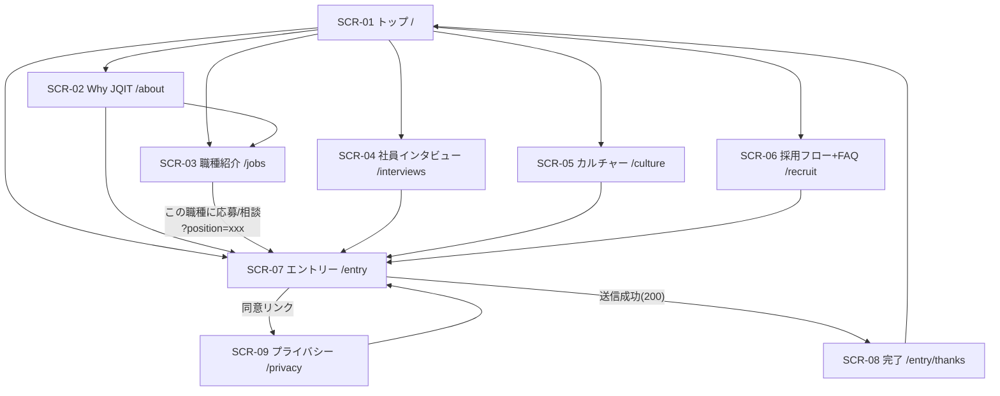
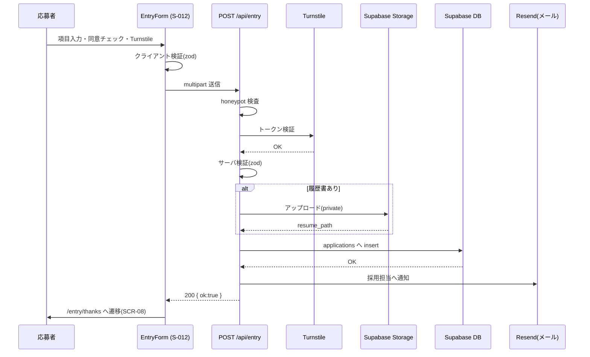

# 画面遷移図 — JQIT 採用サイト

- **対象**: 第1弾（Phase 1）
- **関連**: [screen-design.md](./screen-design.md) / [requirement.md](../docs/requirement.md)

---

## 1. 全体遷移（ナビゲーション）

ヘッダーの GlobalNav（S-002）から、どのページへも遷移可能。CTA は常にエントリーへ誘導。

---

## 2. エントリー送信フロー（主要シナリオ）

---

## 3. 例外・代替フロー

| ケース | 挙動 |
|--------|------|
| 入力不正 / Turnstile失敗 | 400。フォームにフィールドエラー表示、遷移しない（F-010/F-012） |
| 履歴書サイズ超過 | 413。ファイル項目にエラー表示 |
| 連続送信（bot/多重） | 429。一定時間後に再試行を案内 |
| メール送信のみ失敗 | 応募はDB保存済みのため 200 を返し、サンクス遷移（api-design §2.5） |
| サーバエラー | 500。再送を促すメッセージ表示、入力値は保持 |
| honeypot 検出 | 200を返しつつ破棄（botに気づかせない） |

---

## 4. 第1弾スコープ外の遷移（Phase 2 で追加予定）

- `/interviews/[slug]`（インタビュー詳細）
- `/jobs/[slug]`（職種別 詳細ページ）
- フォトギャラリー詳細、ブログ/NEWS 一覧・詳細
